# Project Title

Nexum Finance

---

## Project Description

This protocol is a decentralized credit marketplace that transforms real-world receivables into secure, on-chain collateralized assets.

Businesses can tokenize verified invoices and future cash flows to unlock instant working capital instead of waiting through long payment cycles. These tokenized receivables back structured lending pools that offer lenders fixed, predictable APY derived from borrower interest—delivering stable, real-world yield rather than speculative crypto returns.

Built on the Stellar Development Foundation’s Stellar ecosystem, the platform leverages fast finality, near-zero transaction costs, and native global payment rails. Integrated fiat on/off-ramps enable seamless movement of capital between traditional banking systems and digital assets, making the protocol accessible to both Web3-native users and institutional participants.

Beyond traditional invoices, the protocol supports a broader class of receivables including approved insurance claim settlements, verified merchant payouts, and marketplace earnings from platforms such as Amazon and Shopify.

Risk is managed through a hybrid underwriting framework that combines zero-knowledge (ZK) based verification for data integrity with Web2 credit assessment and cash flow analysis. This ensures that collateral quality is provable without exposing sensitive financial information.

Robust KYC/KYB onboarding, AML screening, and compliance frameworks are embedded by design, enabling verified borrowers and lenders to operate in a secure, transparent, and audit-friendly environment.

The result is a scalable, compliant infrastructure for working-capital financing and private credit—bringing real-world assets and sustainable yield fully on-chain.

---

## Contract Address

### Receivable Token (Shared)

**Address:** `CCNUUFAIOXA4GSY7TWDHDX7TYWVUQ7O6D43WYMKCQOA6XW5PH25U23MG`

---

### Lending Pool 
**Receivable Token:** CC2DRZCX6GB3SKVD6QOKJ4INTCUMOITZAJ4HLVO7JRIFRZDL6LJN3KWK
  **Lending Vault:** CASROYI6HGFXGAEABTMYIYDE3EUK7I7LLC6ZP5NZFB5ZAVY2EQJT5WTS
  **Borrow Contract:** CDYRJVQLCX5TGFATTDJV63NNM4N2OADZ3KTRRRQZG6TJY6ZOT4MFW37X

---

## Problem Statement

### The Problem

Businesses across the globe face significant cash flow constraints due to delayed payments on invoices, insurance claims, merchant settlements, and marketplace payouts. Traditional financing options are:

- Slow and paperwork-heavy
- Geographically limited
- Opaque in pricing and risk
- Inaccessible to smaller businesses or global participants

On the other side, capital providers in crypto are largely limited to volatile, speculative yield opportunities that lack real-world cash flow backing.

### Our Solution

This protocol bridges that gap by:

- Converting verified real-world receivables into on-chain collateral
- Enabling instant liquidity for businesses without selling equity
- Offering lenders predictable, fixed-yield returns backed by real economic activity
- Using ZK proofs and off-chain underwriting to ensure trust, privacy, and compliance
- Leveraging Stellar’s low-cost, fast settlement layer for global scale

---

## Features

- Tokenization of real-world receivables (invoices, claims, payouts)
- Structured lending pools with fixed, predictable APY
- Hybrid underwriting using ZK verification + Web2 credit analysis
- Support for insurance claims, merchant payouts, and marketplace earnings
- Built on Stellar for fast finality and near-zero fees
- Integrated fiat on/off-ramps
- Institutional-grade KYC/KYB and AML compliance
- Privacy-preserving verification of sensitive financial data
- Audit-friendly and regulator-ready architecture

---

## Architecture Overview

High-level architecture components:

- **Borrower Layer**
  - Businesses submit receivables (invoices, claims, payouts)
  - KYB + identity verification
  - Off-chain data ingestion and validation

- **Verification & Underwriting Layer**
  - ZK-based proofs for data integrity
  - Web2 credit scoring and cash flow analysis
  - Risk assessment and pool eligibility checks

- **On-Chain Layer (Stellar)**
  - Tokenized receivable assets
  - Lending pool smart contracts
  - Interest distribution and repayment logic

- **Liquidity & Payments Layer**
  - Fiat on-ramp and off-ramp integrations
  - Cross-border settlement via Stellar Anchors

- **Compliance Layer**
  - KYC/KYB
  - AML screening
  - Audit and reporting hooks

## 1) HLD Diagram (Markdown + Mermaid)

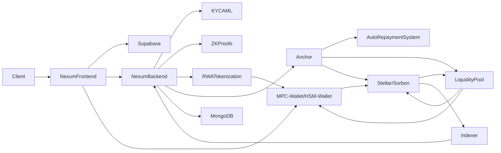

---

## 2) Flow 1 — Onboarding + Compliance

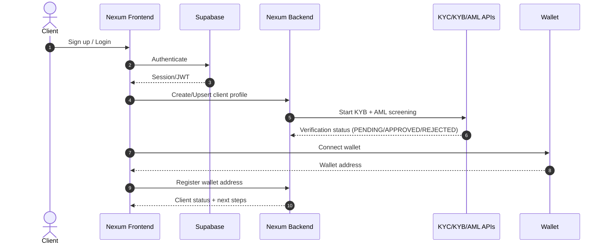

---

## 3) Flow 2 — Receivable Submission + Proof (ZK)

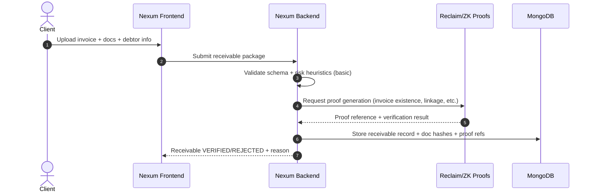

---

## 4) Flow 3 — RWA Tokenization (Mint)

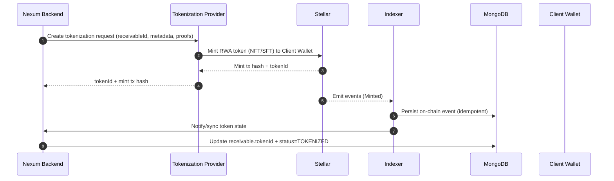

---

## 5) Flow 4 — Collateral Lock (Escrow)

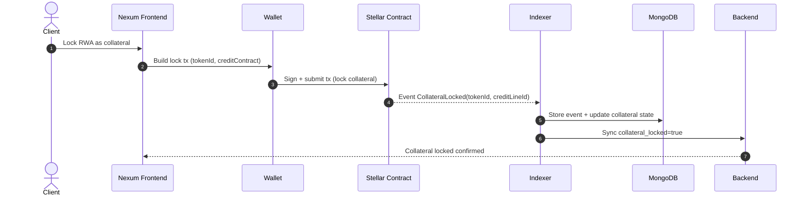

---

## 6) Flow 5 — Credit Line Creation (Underwriting + Allocation)

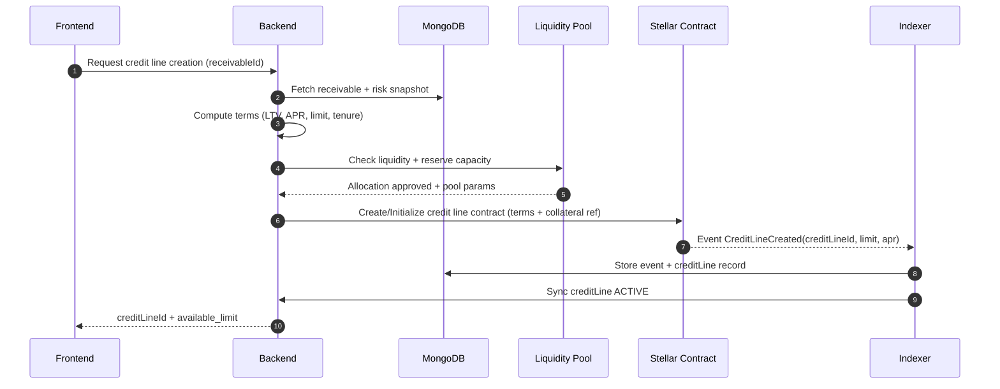

---

## 7) Flow 6 — Drawdown (Borrow)

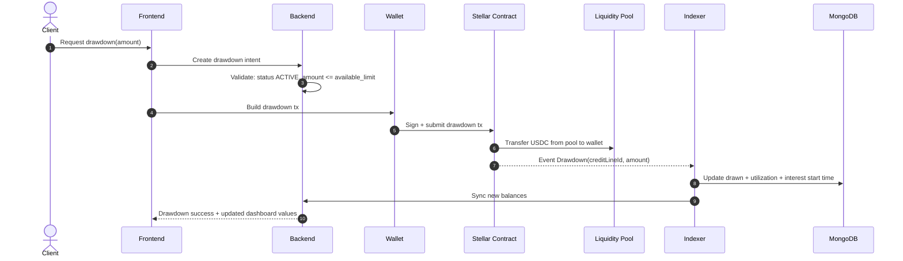

---

## 8) Flow 7 — Repayment / Recoup (Anchor-driven)

### 7A: Auto Recoup (Debtor Pays Fiat → Anchor → USDC → Contract)

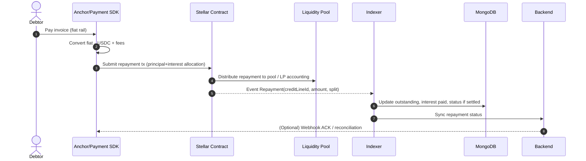

### 7B: Manual Repayment (Borrower Repays)

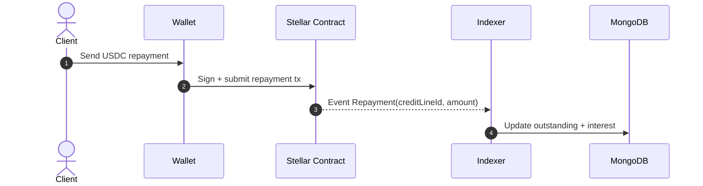

---

## 9) Flow 8 — Closure + Unlock Collateral

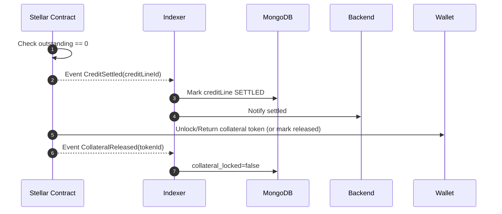

---

## 10) Flow 9 — Default + Liquidation (Minimum Viable Safe Version)

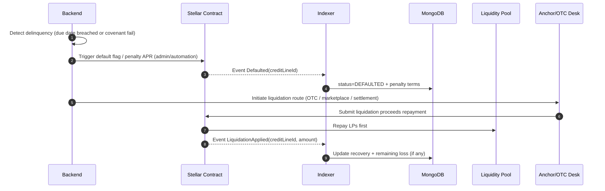

---

## 11) Flow 10 — Indexer Sync (Idempotent, Replay-safe)

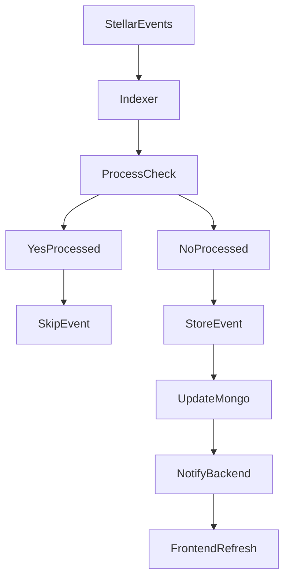

---

## Screenshots of the dApp

>

---

## Deployed Link

https://nexumfi.vercel.app

https://www.loom.com/share/7abd0744df4d4bbc9d7c6f1407d07e71

---

## Future Scope and Plans

- Expansion to additional receivable types (SaaS MRR, payroll receivables and Institutions)
- Dynamic risk-based pricing and pool tranching
- Secondary market for receivable-backed tokens
- DAO-governed risk parameters and pool management
- Integration with more global on/off-ramp partners
- Risk dashboards and reporting tools
- Cross-chain interoperability while retaining Stellar as settlement layer
- Regulatory partnerships and jurisdiction-specific compliance modules

---

## License

MIT
